决策树及其提升
================

## 一、决策树算法

决策树的构造是一个递归的过程，有三种情形会导致递归返回：(1)
当前结点包含的样本全属于同一类别，这时直接将该节点标记为叶节点，并设为相应的类别；(2)
当前属性集为空，或是所有样本在所有属性上取值相同，无法划分，这时将该节点标记为叶节点，并将其类别设为该节点所含样本最多的类别；(3)
当前结点包含的样本集合为空，不能划分，这时也将该节点标记为叶节点，并将其类别设为父节点中所含样本最多的类别。算法的基本流程如下图所示：


可以看出：决策树学习的关键在于如何选择划分属性，不同的划分属性得出不同的分支结构，从而影响整颗决策树的性能。属性划分的目标是让各个划分出来的子节点尽可能地“纯”，即属于同一类别。因此下面便是介绍量化纯度的具体方法，决策树最常用的算法有三种：`ID3`、`C4.5`和`CART`。

### 1\. ID3算法

`ID3`算法使用信息增益为准则来选择划分属性。信息熵（information entropy）是度量样本结合纯度的常用指标，假定当前样本集合
\(D\) 中第 \(k\) 类样本所占比例为 \(p_k\) ，则样本集合 \(D\) 的信息熵定义为：

\[
\operatorname{Ent}(D)=-\sum_{k=1}^{| \mathcal{Y |}} p_{k} \log _{2} p_{k}
\]

$$
\operatorname{Ent}(D)=-\sum_{k=1}^{| \mathcal{Y |}} p_{k} \log _{2} p_{k}
$$

值越大表示越混乱。当只有一个类别时，信息熵为零。

假定通过属性划分样本集 \(D\)，产生了 \(V\) 个分支节点，\(v\) 表示其中第 \(v\)
个分支节点，易知：分支节点包含的样本数越多，表示该分支节点的影响力越大。故可以计算出划分后相比原始数据集
\(D\) 获得的信息增益（information gain）：

\[
\operatorname{Gain}(D, a)=\operatorname{Ent}(D)-\sum_{v=1}^{V} \frac{\left|D^{v}\right|}{|D|} \operatorname{Ent}\left(D^{v}\right)
\]

信息增益越大，表示使用该属性划分样本集 \(D\) 的效果越好，因此`ID3`算法在递归过程中，每次选择最大信息增益的属性作为当前的划分属性。

-----

### 2\. C4.5算法

`ID3`算法存在一个问题，就是偏向于取值数目较多的属性，例如：如果存在一个唯一标识，这样样本集 \(D\) 将会被划分为
\(\left|D\right|\)
个分支，每个分支只有一个样本，这样划分后的信息熵为零，十分纯净，但是对分类毫无用处。因此`C4.5`算法使用了增益率（gain
ratio）来选择划分属性，来避免这个问题带来的困扰。首先使用`ID3`算法计算出信息增益高于平均水平的候选属性，接着`C4.5`计算这些候选属性的增益率，增益率定义为：

\[
\text { Gain ratio }(D, a)=\frac{\operatorname{Gain}(D, a)}{\operatorname{IV}(a)}
\]

其中，\(\mathrm{IV}(a)=-\sum_{v=1}^{V} \frac{\left|D^{v}\right|}{|D|} \log _{2} \frac{\left|D^{v}\right|}{|D|}\)。当
\(a\) 属性的取值越大时，\(\operatorname{IV}(a)\) 值越大。

-----

### 3\. CART算法

`CART`决策树使用基尼指数（Gini index）来选择划分属性，基尼指数反映的是从样本集 \(D\)
中随机抽取两个样本，其类别标记不一致的概率，因此
\(Gini(D)\) 越小越好，基尼指数定义如下：

\[
\begin{aligned}
\operatorname{Gini}(D) &=\sum_{k=1}^{|y|} \sum_{k^{\prime} \neq k} p_{k} p_{k^{\prime}} \\
&=1-\sum_{k=1}^{|y|} p_{k}^{2}
\end{aligned}
\]

任取两个样本标类不一致的概率越小表示集合越纯。

进而，使用属性α划分后的基尼指数为：

\[
\operatorname{Gini} \operatorname{index}(D, a)=\sum_{v=1}^{V} \frac{\left|D^{v}\right|}{|D|} \operatorname{Gini}\left(D^{v}\right)
\]

选择基尼指数最小的划分属性。

-----

## 二、上机练习

以下来自教材上机练习。首先，加载需要的R包：

### 1\. 分类树

`tree`包用于构造分类树和回归树。我们将使用`ISLR`库中的`Carseats`数据。我们将创建虚拟变量`high`来表示大于8的销售额，而不是使用连续变量`Sales`。

``` r
data <- Carseats %>%
  mutate(high = factor(if_else(Sales > 8, 1, 0)))

names(data) <-  str_to_lower(names(data))
```

`tree::tree()`将允许我们调整分类树以预测刚刚创建的变量。第一个参数是我们现在唯一需要担心的。我们只需要插入用于进行预测的公式，类似于`lm()`。有多种包可用于执行递归分区，如`rpart`和`ctree`。如果您想了解更多信息，可以访问[关于相关方法的博客文章](https://www.r-bloggers.com/a-brief-tour-of-the-trees-and-forests/)。

``` r
# Set up initial tree
tree <- tree(high ~ . -sales, data)
```

该树的输出存储在一个列表中，我们可以对列表进行总结，以便查看内部节点中使用的变量、终端节点的数量和训练错误率。您还可以调用对象本身来获得树的整个表示。终端节点用星号表示。

``` r
summary(tree)
```

    ## 
    ## Classification tree:
    ## tree(formula = high ~ . - sales, data = data)
    ## Variables actually used in tree construction:
    ## [1] "shelveloc"   "price"       "income"      "compprice"   "population" 
    ## [6] "advertising" "age"         "us"         
    ## Number of terminal nodes:  27 
    ## Residual mean deviance:  0.4575 = 170.7 / 373 
    ## Misclassification error rate: 0.09 = 36 / 400

我们知道树很容易被直观地解释，所以让我们看看我们的测试用例是什么样子的。小心绘制，因为树很容易失控，使图形无法读取。从我们目前的结果图中可以看出：

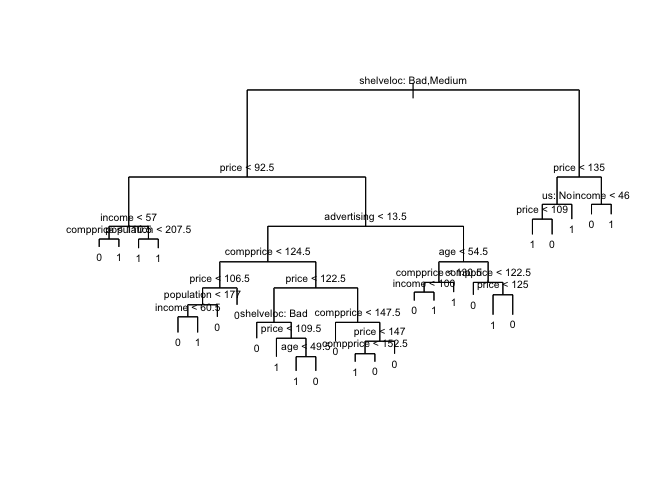<!-- -->

**用’rpart’美化决策树**

（1）生成决策树

``` r
library(rpart)
fit <- rpart(high ~ . -sales, data = data)
par(mar = rep(0.1, 4))
plot(fit, branch = 1)
text(fit, use.n = TRUE)
```

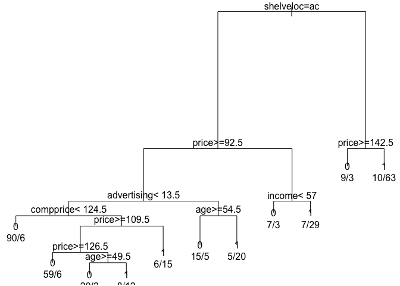<!-- -->

（2）调用rpart.plot包进行绘图

``` r
library(rpart.plot)
rpart.plot(fit,type=2,extra=4)
```

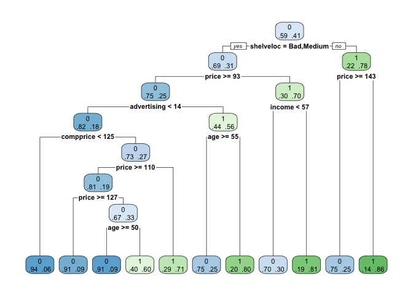<!-- -->

（3）调用rattle包的fancyRpartPlot函数绘图

``` r
library(rattle)
```

    ## Rattle: A free graphical interface for data science with R.
    ## Version 5.3.0 Copyright (c) 2006-2018 Togaware Pty Ltd.
    ## Type 'rattle()' to shake, rattle, and roll your data.

    ## 
    ## Attaching package: 'rattle'

    ## The following object is masked from 'package:randomForest':
    ## 
    ##     importance

``` r
fancyRpartPlot(fit, sub="", palettes=c("Blues", "Greens"), type=2)
```

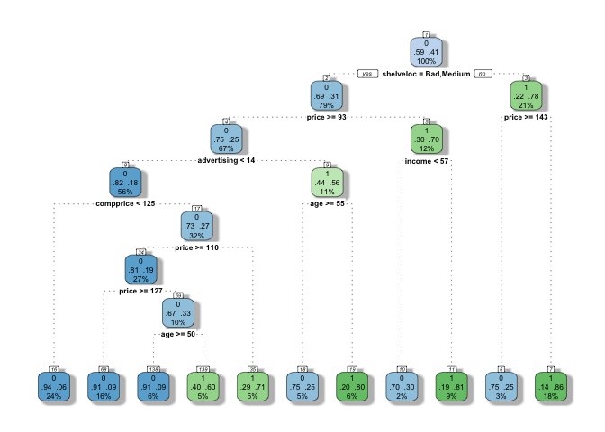<!-- -->

（4）决策树生成的逻辑

``` r
asRules(fit)
```

    ## 
    ##  Rule number: 7 [high=1 cover=73 (18%) prob=0.86]
    ##    shelveloc=Good
    ##    price< 142.5
    ## 
    ##  Rule number: 11 [high=1 cover=36 (9%) prob=0.81]
    ##    shelveloc=Bad,Medium
    ##    price< 92.5
    ##    income>=57
    ## 
    ##  Rule number: 19 [high=1 cover=25 (6%) prob=0.80]
    ##    shelveloc=Bad,Medium
    ##    price>=92.5
    ##    advertising>=13.5
    ##    age< 54.5
    ## 
    ##  Rule number: 35 [high=1 cover=21 (5%) prob=0.71]
    ##    shelveloc=Bad,Medium
    ##    price>=92.5
    ##    advertising< 13.5
    ##    compprice>=124.5
    ##    price< 109.5
    ## 
    ##  Rule number: 139 [high=1 cover=20 (5%) prob=0.60]
    ##    shelveloc=Bad,Medium
    ##    price>=92.5
    ##    advertising< 13.5
    ##    compprice>=124.5
    ##    price>=109.5
    ##    price< 126.5
    ##    age< 49.5
    ## 
    ##  Rule number: 10 [high=0 cover=10 (2%) prob=0.30]
    ##    shelveloc=Bad,Medium
    ##    price< 92.5
    ##    income< 57
    ## 
    ##  Rule number: 6 [high=0 cover=12 (3%) prob=0.25]
    ##    shelveloc=Good
    ##    price>=142.5
    ## 
    ##  Rule number: 18 [high=0 cover=20 (5%) prob=0.25]
    ##    shelveloc=Bad,Medium
    ##    price>=92.5
    ##    advertising>=13.5
    ##    age>=54.5
    ## 
    ##  Rule number: 68 [high=0 cover=65 (16%) prob=0.09]
    ##    shelveloc=Bad,Medium
    ##    price>=92.5
    ##    advertising< 13.5
    ##    compprice>=124.5
    ##    price>=109.5
    ##    price>=126.5
    ## 
    ##  Rule number: 138 [high=0 cover=22 (6%) prob=0.09]
    ##    shelveloc=Bad,Medium
    ##    price>=92.5
    ##    advertising< 13.5
    ##    compprice>=124.5
    ##    price>=109.5
    ##    price< 126.5
    ##    age>=49.5
    ## 
    ##  Rule number: 16 [high=0 cover=96 (24%) prob=0.06]
    ##    shelveloc=Bad,Medium
    ##    price>=92.5
    ##    advertising< 13.5
    ##    compprice< 124.5

为了评估分类树，我们需要使用训练集和测试集。现在我们重复上面的步骤，这次包括测试错误率（test error rate）的计算。

``` r
# Define our training/testing sets
set.seed(2)
train <- sample_n(data, 200)
test <-  setdiff(data, train)

# Run the recursive partioning algorithm
ttree <- tree(high ~. -sales, data = train)

# Make predictions and display confusion matrix
test_predictions <- predict(ttree, test, type = 'class')
table(test_predictions, test$high)
```

    ##                 
    ## test_predictions   0   1
    ##                0 104  33
    ##                1  13  50

``` r
(86 + 57) / 200
```

    ## [1] 0.715

现在我们可以通过修剪我们的结果来添加另一层复杂性。回想一下，未运行的树容易过度拟合数据，因此我们的方法是观察测试错误率的变化，因为我们增加了终端节点数量的惩罚。为了刷新你的记忆，我们总结了算法8.1：

**算法8.1: 修剪树**

1.  使用训练数据生成原始树 \(T_0\)；（Grow your original tree \(T_0\) using your
    training data）
2.  作为 \(\alpha\)（惩罚参数）的函数，定义最佳子树序列；（As a function of \(\alpha\) (the
    penalty parameter), define a sequence of best subtrees）
3.  使用K-fold交叉验证来找到 \(\alpha\)，它使 \(K\)th 倍训练数据的平均均方预测误差最小化；（Use K-fold
    cross-validation to find the \(\alpha\) that minimizes the average
    mean squared prediction error of the \(k\)th fold of the training
    data）
4.  使用上一步中找到的 \(\alpha\) 查找步骤2中的最佳子树。（Find the best subtree from Step 2
    using the \(\alpha\) found in the previous
step）

幸运的是，`tree::cv.tree`包含的内容将为我们完成大部分工作。它将执行确定最佳树大小所需的交叉验证。它还允许我们选择修剪树的函数。在这种情况下，我们修剪将由分类错误率（classification
error rate）指导。

``` r
set.seed(3)
cv_tree <- cv.tree(ttree, FUN = prune.misclass)
cv_tree
```

    ## $size
    ## [1] 21 19 14  9  8  5  3  2  1
    ## 
    ## $dev
    ## [1] 74 76 81 81 75 77 78 85 81
    ## 
    ## $k
    ## [1] -Inf  0.0  1.0  1.4  2.0  3.0  4.0  9.0 18.0
    ## 
    ## $method
    ## [1] "misclass"
    ## 
    ## attr(,"class")
    ## [1] "prune"         "tree.sequence"

这些结果中最重要的是
`$dev`，它对应于每个实例中的交叉验证错误。我们可以看到，最小值发生在有9个终端节点的情况下。让我们快速了解一下错误在终端节点数量上的变化：

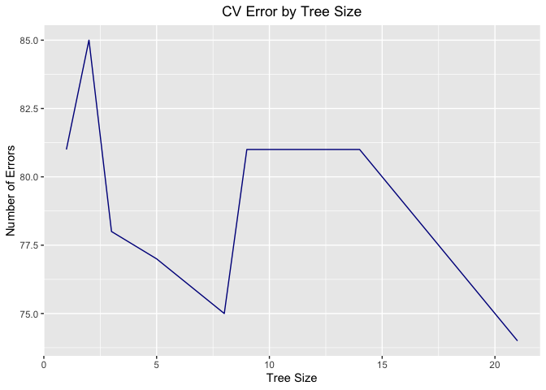<!-- -->

现在我们知道到底需要多少个终端节点，就用 `prune.misclass()` 来修剪树，以获得最佳树。然后，检查该树在测试集上的性能是否比基树
\(T_0\) 更好。

``` r
pruned <- prune.misclass(ttree, best = 9)

test_predictions <- predict(pruned, data = test, type = 'class')
table(test_predictions, test$high)
```

    ##                 
    ## test_predictions  0  1
    ##                0 77 45
    ##                1 40 38

``` r
(94 + 60) / 200
```

    ## [1] 0.77

-----

### 2\. 回归树

当我们切换到回归树时，在代码方面没有太大的变化，所以这一部分将是对前一部分的概述，只是使用不同的数据。为此，我们从`MASS`包中提取`Boston`数据集。

``` r
Boston <- MASS::Boston
set.seed(1)
train <- sample_frac(Boston, .5) 
test <-  setdiff(Boston, train)

tree_train <- tree(medv ~ ., data = train)
summary(tree_train)
```

    ## 
    ## Regression tree:
    ## tree(formula = medv ~ ., data = train)
    ## Variables actually used in tree construction:
    ## [1] "rm"    "lstat" "crim"  "age"  
    ## Number of terminal nodes:  7 
    ## Residual mean deviance:  10.38 = 2555 / 246 
    ## Distribution of residuals:
    ##     Min.  1st Qu.   Median     Mean  3rd Qu.     Max. 
    ## -10.1800  -1.7770  -0.1775   0.0000   1.9230  16.5800

``` r
plot(tree_train)
text(tree_train, pretty = 0, cex = .65)
```

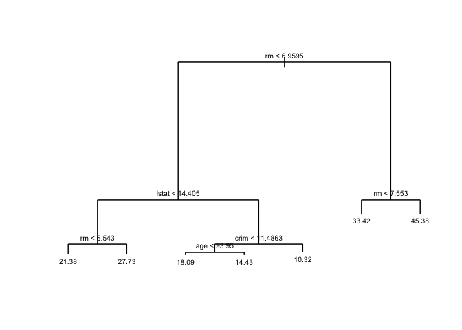<!-- -->

如您所见，`lstat < 9.715`
是此树中的第一个分区。该变量衡量的是邻近地区社会经济地位较低的个人所占的百分比。基于树左侧的终端节点，这表明较高的社会经济地理区域最终会产生更大的房价中值。

我们现在可以继续看修剪是否会提高这棵树的性能：

``` r
cv_tree <- cv.tree(tree_train)

# Get an idea of change in error by changing tree size
ggplot(data = data.frame(cv_tree$size, cv_tree$dev),
  aes(x = cv_tree$size, y = cv_tree$dev)) +
  geom_line(color = "darkblue") +
  labs(x = "Tree Size", y = "Number of Errors", title = "CV Error by Tree Size") +
  theme(plot.title = element_text(hjust = .5))
```

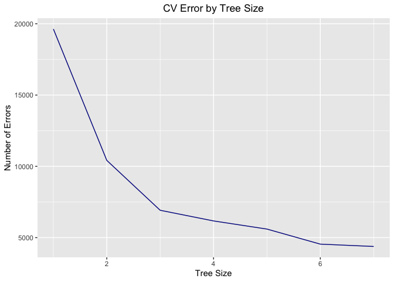<!-- -->

``` r
# Predict, plot, and calculate MSE
yhat <- predict(tree_train, newdata = test)
test_outcomes <- test$medv

plot(yhat, test_outcomes)
```

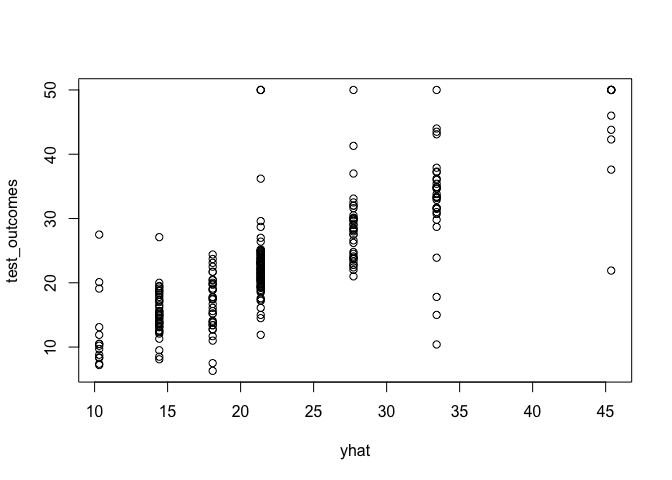<!-- -->

``` r
mean((yhat - test_outcomes)^2)
```

    ## [1] 35.28688

-----

### 3\. 装袋法与随机森林

我们将使用上一节中的相同数据和 `randomForest`
包来帮助我们完成一些简单的示例。我们从一个装袋的例子开始，在每个分割中使用所有的预测值。

``` r
set.seed(1)
train <- sample_frac(Boston, .5) 
test <-  setdiff(Boston, train)

# Set up the randomForest for the bagging case (all vars included)
bag <- randomForest(medv ~ ., data = train,
                    mtry = 13, importance = TRUE) 
bag
```

    ## 
    ## Call:
    ##  randomForest(formula = medv ~ ., data = train, mtry = 13, importance = TRUE) 
    ##                Type of random forest: regression
    ##                      Number of trees: 500
    ## No. of variables tried at each split: 13
    ## 
    ##           Mean of squared residuals: 11.33119
    ##                     % Var explained: 85.26

``` r
# Calculate MSE of the testing set for the bagged regression tree
yhat <- predict(bag, test)
mean((yhat - test$medv)^2)
```

    ## [1] 23.4579

将袋装随机林的最小均方误差（MSE）与第2节中的最佳修剪单株树进行比较——它要低得多。在上面的装袋示例中，我们手动更改了每次拆分时的变量数量，但是使用更一般的随机林可能会获得更好的结果。默认情况下，`randomForest`
在构建回归树林时使用\(p/3\)变量，而对于分类树则使用 \(\sqrt p\)。在下面的示例中，我们将使用 `mtry=6`
(\(m \approx p/2\))。

``` r
forest <- randomForest(medv ~., data = train, mtry = 6, importance = TRUE)

yhat <- predict(forest, test)
mean((yhat - test$medv)^2)
```

    ## [1] 19.88374

我们发现这种方法是有效的-我们的MSE现在降低到11.37，低于我们之前尝试的两种方法。一旦找到一个合适的林，我们就可以使用
`importance()` 检查每个变量的重要性。

    importance(forest)

``` 
         %IncMSE IncNodePurity
crim    16.559672    1087.13756
zn       2.173197     116.87703
indus    5.621875     608.58015
chas     1.158773      25.34891
nox     11.666801     723.23020
rm      35.661262    8113.71864
age     14.860390     632.80623
dis      9.269251     720.28367
rad      5.078931      87.02577
tax      8.253927     299.94292
ptratio  7.428535     793.60664
black    8.314067     252.93385
lstat   28.647399    5689.90580
```

第一列表示从模型中移除变量时预测精度的平均降低，第二列表示由于对该变量进行拆分（对所有树进行平均）而导致的节点杂质的总降低。`randomForest::varImpPlot()`
为我们绘制这些重要度量：

``` r
varImpPlot(forest)
```

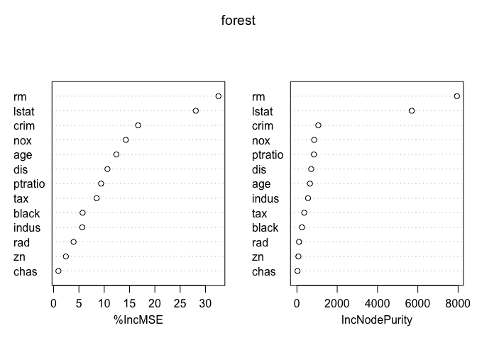<!-- -->

-----

### 4\. 提升算法

我们将使用 `gbm` 包帮助我们将增强的回归树与 `Boston` 数据集相匹配，您现在应该已经熟悉了。

``` r
set.seed(1)
train <- sample_frac(Boston, .5) 
test <-  setdiff(Boston, train)

boosted <- gbm(medv ~ ., train, distribution = 'gaussian', # regression => distr = 'gaussian'
               n.trees = 5000, interaction.depth = 4)

# Summarize and produce a quick plot to highlight importance of variables
summary(boosted)
```

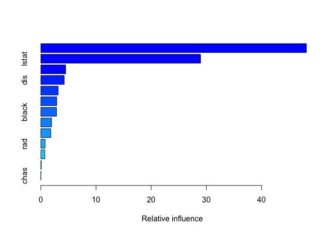<!-- -->

    ##             var     rel.inf
    ## rm           rm 48.13967682
    ## lstat     lstat 28.93851185
    ## crim       crim  4.49413146
    ## dis         dis  4.23182696
    ## age         age  3.14221169
    ## nox         nox  2.88094283
    ## black     black  2.83238772
    ## ptratio ptratio  1.93050932
    ## tax         tax  1.80427054
    ## rad         rad  0.77569461
    ## indus     indus  0.73110525
    ## zn           zn  0.07442923
    ## chas       chas  0.02430170

现在我们来绘制这两个最重要的变量 `lstat` 和 `rm` 的边际效应\`：

``` r
par(mfrow = c(1,2))
plot(boosted, i = 'rm')
```

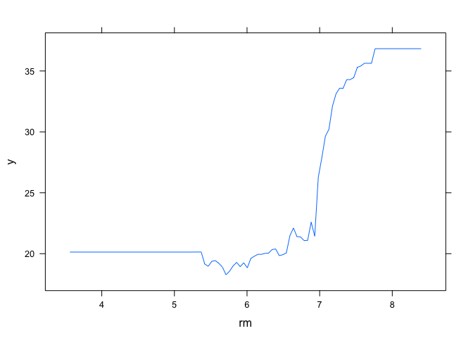<!-- -->

``` r
plot(boosted, i = 'lstat')
```

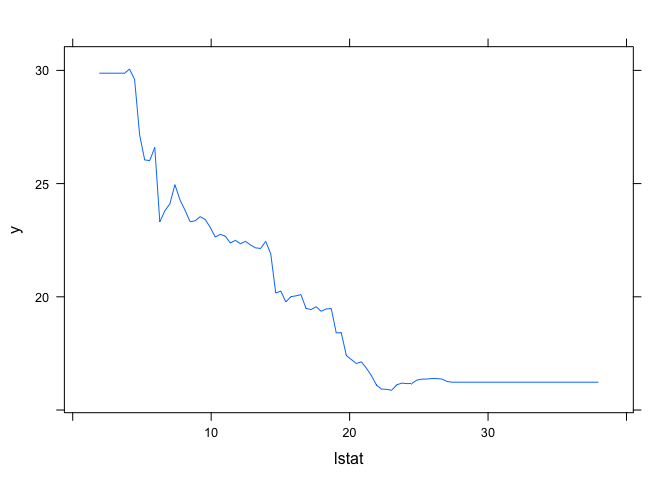<!-- -->

好吧-这正好证实了我们本该期待的：房价中值在 `lstat` 下降，在 `rm` 上升。现在让我们来测试这个增强的回归树对测试数据的执行情况：

``` r
yhat <- predict(boosted, newdata = test, n.trees = 5000)
mean((yhat - test$medv)^2)
```

    ## [1] 19.37033

不惊人，但也不错。提升模型的性能与随机林几乎相同，并且优于装袋模型，但是我们可以通过更改收缩参数 \(\lambda\)
来挤出一些额外的性能。默认值是 .001，但我们将其提高到 \(\lambda=.2\)：

``` r
boosted <- gbm(medv ~., train, distribution = 'gaussian',
               n.trees = 5000, interaction.depth = 4,
               shrinkage = .2, verbose = F)
yhat <- predict(boosted, newdata = test, n.trees = 5000)
mean((yhat - test$medv)^2)
```

    ## [1] 18.68911

改变收缩率参数实际上是有区别的——我们现在只是稍微低于我们从上一个模型中得到的，它等于 .001。
